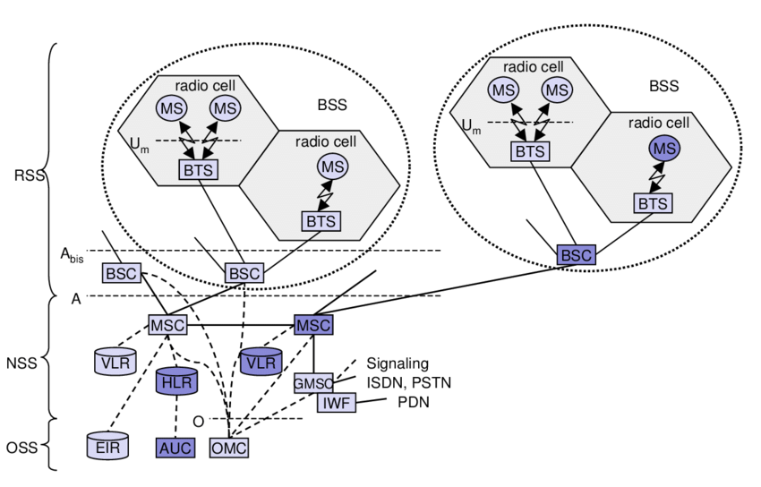
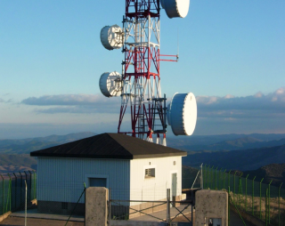
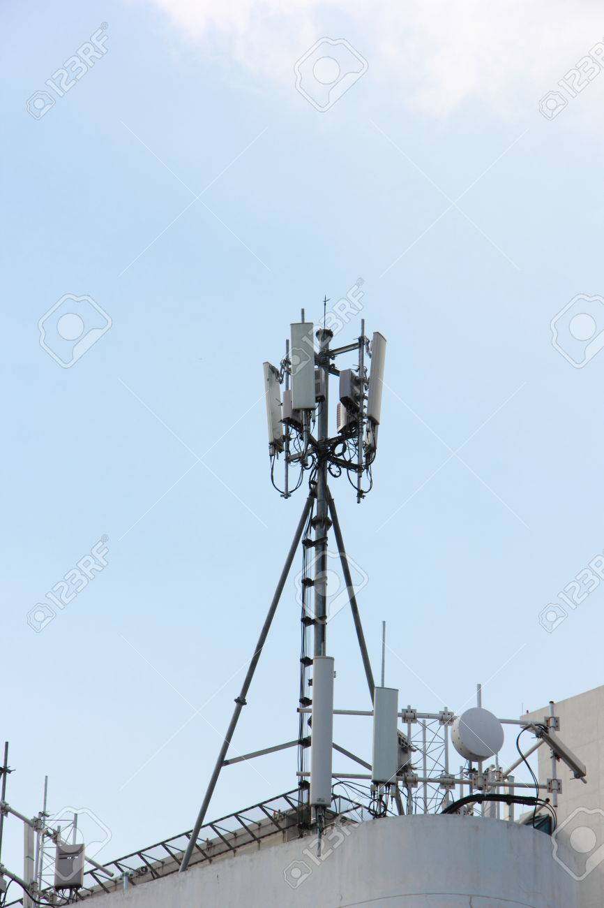
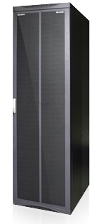
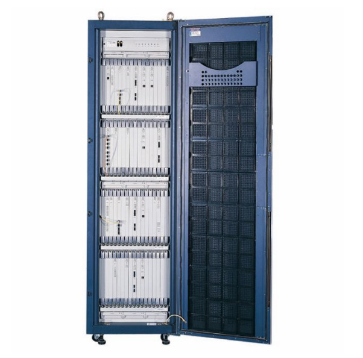

# GSM - Global System for Mobile Communication

GSM is based on set of standards formulated in the early 1980`s by companies nokia, motorola etc.

The goals of GSM are,
- Supports international roaming
- Clear voice clarity
- Iternational ISDN compatibility
- Ability to support multiple handheld devices
- low powered handheld devices

The architecture can be divided into,

- Radio/Base Station Subsystem (RSS/BSS)
- Network Switching Subsystem (NSS)
- The Operation Support Subsystem (OSS)

## Architecture

#### Mobile Station (MS)
The mobile station consists of user equipment (UE) and the subscriber identity module (SIM).

#### Base Transceiver Station (BTS)

The base transceiver station faciliates the wireless communication between user equipment and the network. BTS can handle serveral cells. The UE communicates with BTS using the **Um interface/air interface**. Um interface is the radio link between UE and BTS.

[]

#### Radio Cell

The cell consists of BTS and MS. A cell is handled by only one BTS.

Wikipedia says, 

*The network is distributed over land areas called "cells", each served by at least one fixed-location transceiver, but more normally, three cell sites or base transceiver stations. These base stations provide the cell with the network coverage which can be used for transmission of voice, data, and other types of content. A cell typically uses a different set of frequencies from neighbouring cells, to avoid interference and provide guaranteed service quality within each cell*

#### Base Station Controller (BSC)

Base station controller controles one or more BTS. BTS does only what BSC instructs to do.  
- BSC tells BTS which frequencise to use for the radio communication. 
- A BTS does not route traffic as it is hooked to exactly one BSC.
- BTS does not even route traffic to one of several mobiles attached to the BTS as this is done by the BSC. 

Multiple BTS connects to the base station controller via **Abis interface**. BTS is more likely a Um-to-Abis physical layer and protocol transcoder.   

# References

- https://en.wikipedia.org/wiki/Cellular_network
- https://www.youtube.com/watch?v=t8a4GjVnqR8   
- https://www.youtube.com/watch?v=TLRJPYvibsI  
- https://www.researchgate.net/figure/GSM-Architecture-and-Entities-Involved-in-Authentication_fig4_2388978 
- https://stackoverflow.com/questions/3183252/cell-cell-id-bts-and-bss-in-gsm-network
